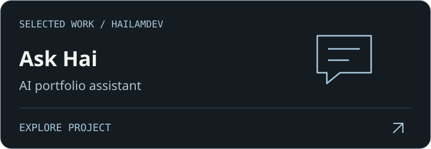
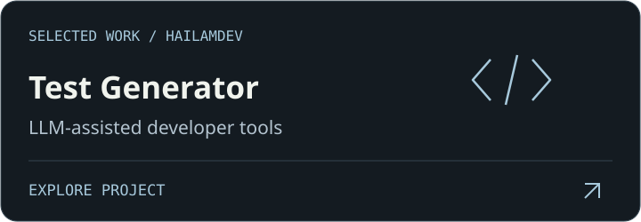
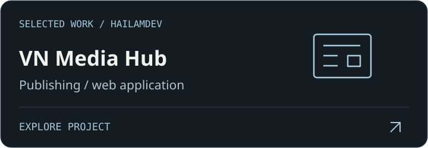
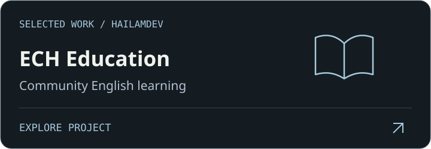

  
  
  
  

<strong>React · ASP.NET Core · Python · AI integrations</strong>

## Security, through code

<strong>🔬 Research notes · scope &amp; limitations</strong>

- **Malware:** static-analysis code for hashes, metadata, strings, entropy and disassembly. Broader workflows remain prototype work.
- **DDoS:** monitoring and simulation prototypes; synthetic connection records are not real-world attack benchmarks.
- **SQLi / XSS:** research into query construction, browser execution contexts and sensitive-input risks.
- **RAT:** Python client/server, TLS 1.3 and newline-delimited JSON. Encryption alone is not authorization. [Read the architecture case study](https://my-portfolio-nxh.vercel.app/projects/security-lab).

These are research prototypes, not audited or production-ready security products.

> 🛡️ **Research prototypes · Authorized labs only** 
> Not audited or production-ready. Use isolated environments with explicit permission.

## Beyond the lab

<strong>Toolbox, writing & learning</strong>

| Build | Explore | Deliver |
| :--- | :--- | :--- |
| React · Next.js · TypeScript | Python · TLS · Binary analysis | Docker · GitHub Actions |
| ASP.NET Core · C# · Node.js | Gemini · DeepSeek | Vercel · Cloudflare |
| SQL Server · PostgreSQL · MySQL | GSAP · Three.js | Git |

[Development notes on Dev.to](https://dev.to/xuanhai0913) · [AWS learning profile](https://skillsprofile.skillbuilder.aws/user/xuanhai0913)

---

<strong>Open to full-stack roles &amp; collaborations.</strong>

