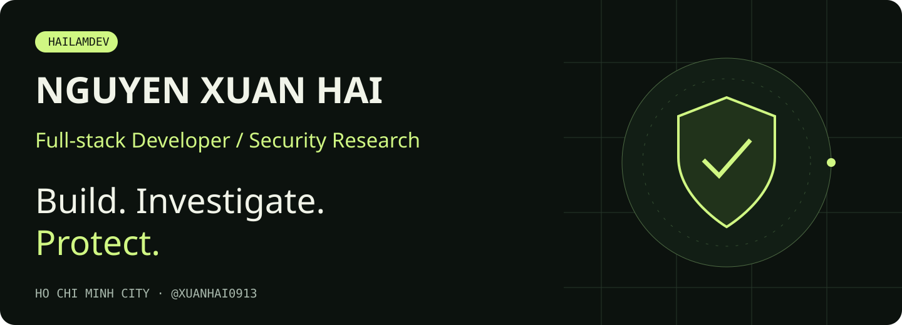
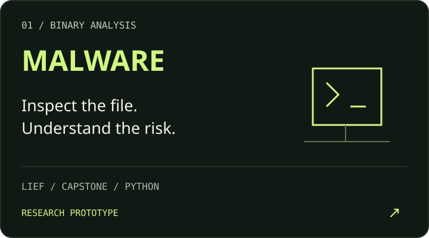
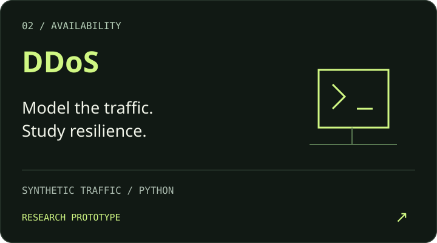
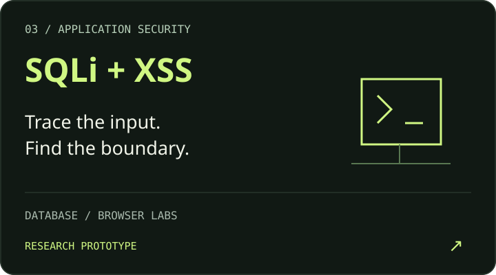
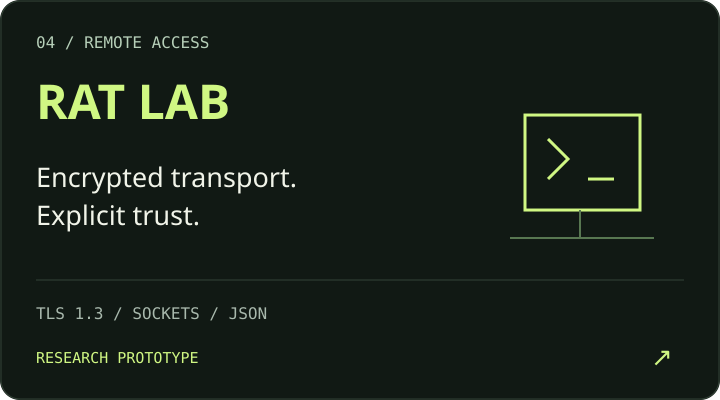

  
  
  
  

<strong>React · ASP.NET Core · Python · AI integrations</strong>

## Security, through code

**Web labs:** [SQLI-V1-HAILAMDEV](https://github.com/xuanhai0913/SQLI-V1-HAILAMDEV) · [KLG-XSS-HAILAMDEV](https://github.com/xuanhai0913/KLG-XSS-HAILAMDEV)

**[Explore the interactive threat map →](https://my-portfolio-nxh.vercel.app/security)**

<strong>Inside the labs: implementation & limitations</strong>

- **Malware:** static-analysis code for hashes, metadata, strings, entropy and disassembly. Broader workflows remain prototype work.
- **DDoS:** monitoring and simulation prototypes; synthetic connection records are not real-world attack benchmarks.
- **SQLi / XSS:** research into query construction, browser execution contexts and sensitive-input risks.
- **RAT:** Python client/server, TLS 1.3 and newline-delimited JSON. Encryption alone is not authorization. [Read the architecture case study](https://my-portfolio-nxh.vercel.app/projects/security-lab).

These are research prototypes, not audited or production-ready security products.

> **Authorized research only.** Dual-use labs belong in isolated, explicitly permitted environments—not public networks or other people's systems.

## Beyond the lab

**[Portfolio & Ask Hai](https://my-portfolio-nxh.vercel.app)** 
An AI-assisted portfolio with project evidence and interactive explainers. [Source ↗](https://github.com/xuanhai0913/My-Portfolio-NXH)

**[LLM Unit Test Generator](https://github.com/xuanhai0913/LLM-Unit-tests)** 
Exploring test generation from source code with LLMs.

**[VN Media Hub](https://vnmediahub.com) · [ECH Education](https://ech.edu.vn)** 
Web application work, content publishing and community English learning.

[More projects & my role in each →](https://my-portfolio-nxh.vercel.app#portfolio)

<strong>Toolbox, writing & learning</strong>

| Build | Explore | Deliver |
| :--- | :--- | :--- |
| React · Next.js · TypeScript | Python · TLS · Binary analysis | Docker · GitHub Actions |
| ASP.NET Core · C# · Node.js | Gemini · DeepSeek | Vercel · Cloudflare |
| SQL Server · PostgreSQL · MySQL | GSAP · Three.js | Git |

[Development notes on Dev.to](https://dev.to/xuanhai0913) · [AWS learning profile](https://skillsprofile.skillbuilder.aws/user/xuanhai0913)

---

<strong>Open to full-stack roles &amp; collaborations.</strong>

